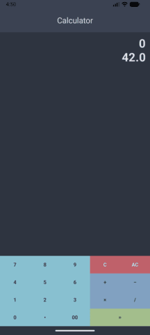

# Module00  

ex00 – ex03 are implemented as separate projects. In Android Studio, each folder must be opened **individually**. It is not possible to open the entire module00 at once, sorry.  
The fully functional calculator is ex03.  

* [ex00 - single file](module00/ex00/composeApp/src/commonMain/kotlin/com/ronia/fr/ex00/App.kt)  
* [ex01 - single file](module00/ex01/composeApp/src/commonMain/kotlin/com/ronia/fr/module00/ex01/App.kt)  
* [ex02 - single file](module00/ex02/composeApp/src/commonMain/kotlin/com/ronia/fr/module00/module00_ex02/App.kt)  

## ex03 - the calculator itself:  

* The input is validated using a finite state machine.  
[ex03 - fsm](module00/ex03/composeApp/src/commonMain/kotlin/com/ronia/fr/module00/ex03/calculator/CalculatorFSM.kt)  

* Computations are performed using an interpreter.  
[ex03 - interpreter](module00/ex03/composeApp/src/commonMain/kotlin/com/ronia/fr/module00/ex03/calculator/Interpreter.kt)  

* There are tests for both the automaton and the interpreter.  
[ex03 = tests](module00/ex03/composeApp/src/commonTest/kotlin/com/ronia/fr/module00/ex03)

# Module01

## ex00 
[ex00 - single file](module01/ex00/composeApp/src/commonMain/kotlin/com/ronia/fr/module01/ex00/App.kt)  

For navigation, the ['Navigation bar'](https://developer.android.com/develop/ui/compose/components/navigation-bar) component is used. 
For some reason, it was necessary to manually add a line ``implementation(libs.navigation.compose)`` to the file 
module00/Module01_ex00/composeApp/build.gradle.kts (section commonMain.dependencies).  

The icons were downloaded from the website https://composables.com/icons in XML format to the composeResources/drawable directory,
since the old icon library, Material Icon, is no longer supported. The build tool should automatically add these icons to Res.drawable.
